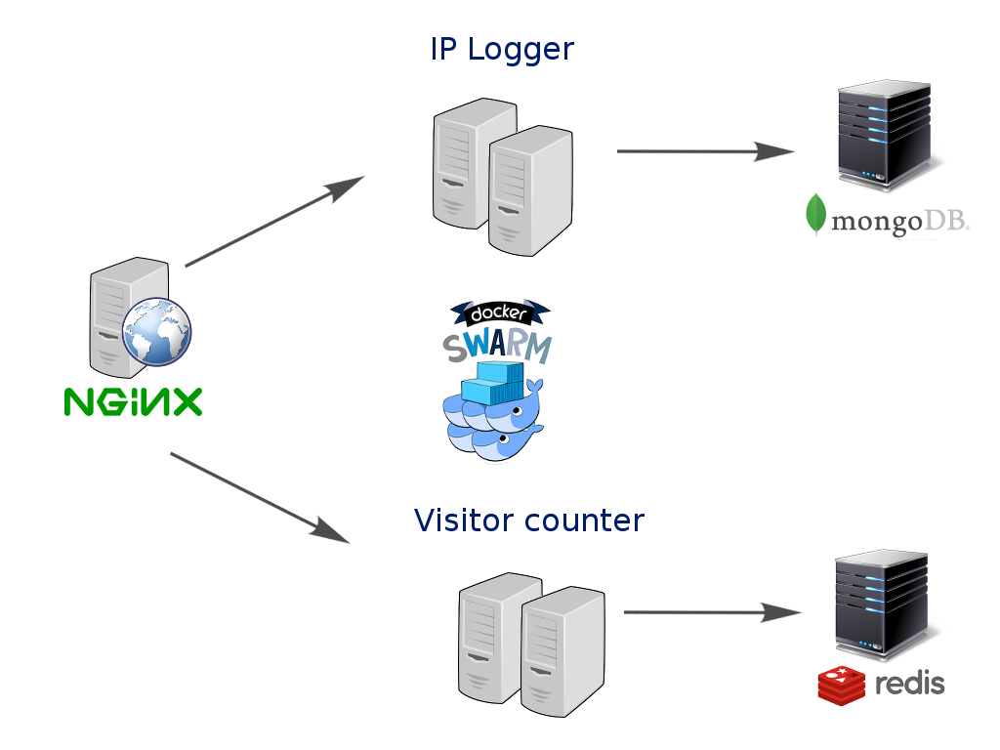

# Continuous Deployment with Docker (swarm mode)


### [View all Roadmaps](https://github.com/nholuongut/all-roadmaps) &nbsp;&middot;&nbsp; [Best Practices](https://github.com/nholuongut/all-roadmaps/blob/main/public/best-practices/) &nbsp;&middot;&nbsp; [Questions](https://www.linkedin.com/in/nholuong/)

## Description

This project shows a web application built using a microservices architecture.

There are two microservices:
- **rest-count** implemented in Python (Flask microframework) using a Redis database
- **rest-ip** implemented in Node.js (Express framework) using a MongoDB database



## Prerequisites

Docker 17.06.0-ce

(see [legacy](https://github.com/nholuongut/docker-continuous-deployment/tree/legacy) tag if you're interested into the previous version for Docker 1.11 using docker-compose and consul.)

## Getting started

run on a single node docker swarm cluster the following commands in terminal (the first time you have to wait for a few minutes to download the Docker base images), :

```
docker stack deploy -c docker-compose.yml cd
```

open your browser to <http://127.0.0.1:8080/>

you can check the services on <http://127.0.0.1:8080/visualizer/>

now edit `rest-count/main.py` (for example, you can increase the version to 1.1)

```
docker build -t francescou/rest-count:1.1 rest-count/

docker service update --image francescou/rest-count:1.1 cd_restcount
```

the updated microservice will be deployed with no downtime.

You can also modify the _rest-ip_ microservice in the same way (see `rest-ip/app.js`).

## Scaling microservices

this section will explain how to can scale up and down the docker services.

open your browser to <http://127.0.0.1:8080/visualizer/>. There you will find a _rest-count_ service, running on two replicas. Execute

    docker service scale cd_restcount=4

check again <http://127.0.0.1:8080/visualizer/> to ensure that there are now four _rest-count_ instance.

Make a few requests to <http://127.0.0.1:8080/api/v1/count> and then run `docker service logs cd_restcount` to see how requests are processed by different _rest-count_ instances.

You can now scale down the _rest-count_ service without having any down time, e.g.:

    docker service scale cd_restcount=2

Again, you can check <http://127.0.0.1:8080/visualizer/> to see that there are now only two instances.

I'm are always open to your feedback.  Please contact as bellow information:
### [Contact ]
* [Name: nho Luong]
* [Skype](luongutnho_skype)
* [Github](https://github.com/nholuongut/)
* [Linkedin](https://www.linkedin.com/in/nholuong/)
* [Email Address](luongutnho@hotmail.com)


[](https://ko-fi.com/nholuong)

# License
* Nho Luong (c). All Rights Reserved.
